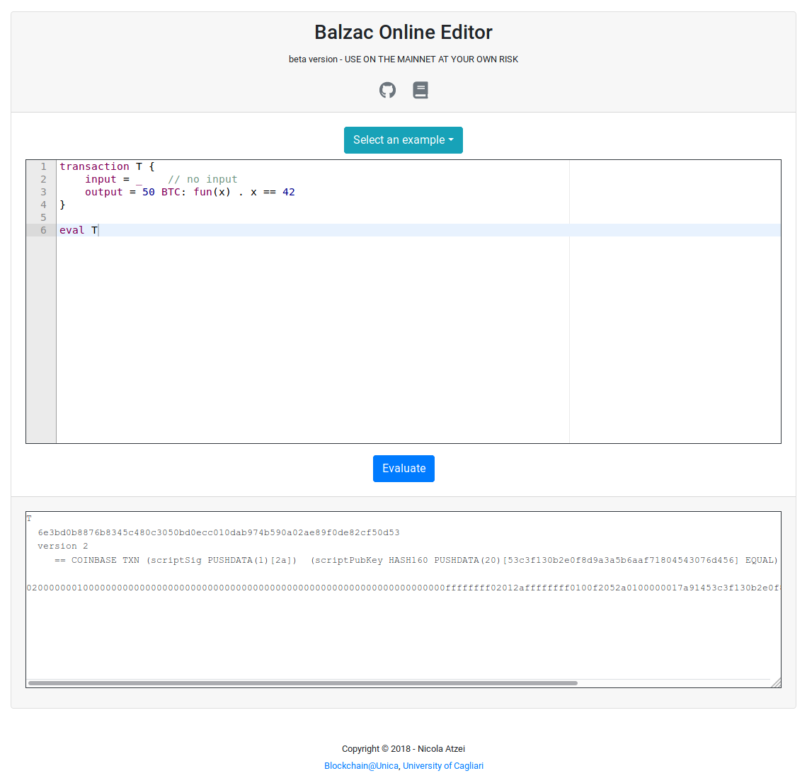
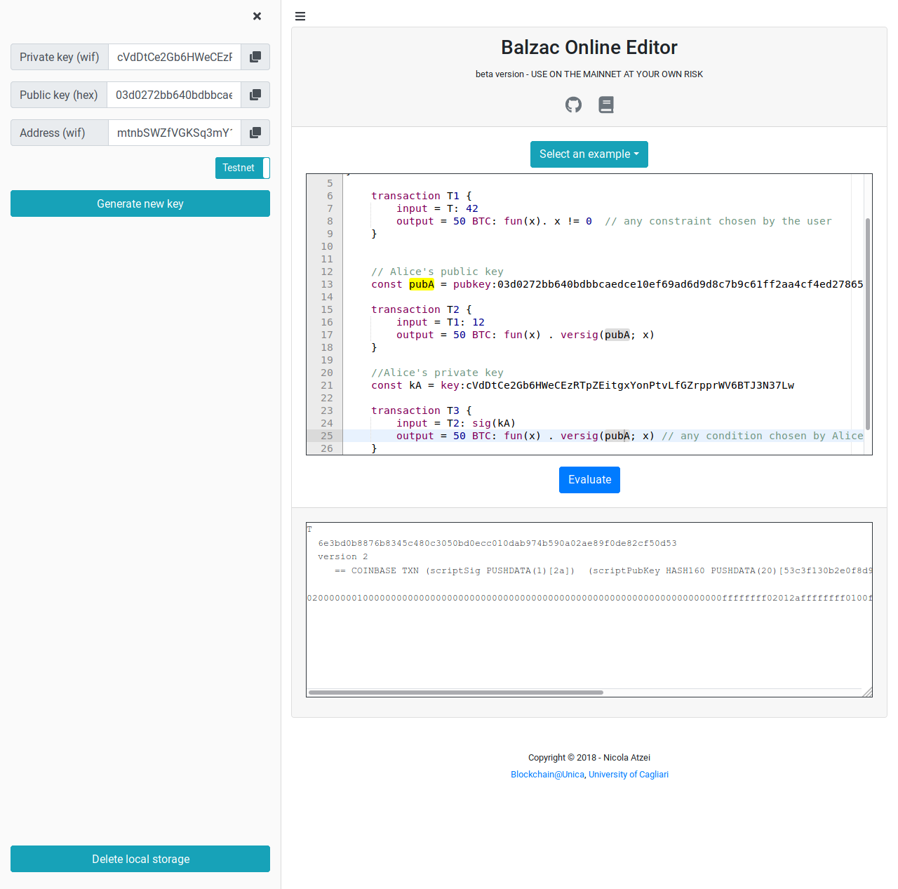

=========================
|langname| in a nutshell
=========================

.. highlight:: btm

BALZaC (for Bitcoin Abstract Language, Analyzer and Compiler)
is a domain-specific language to write Bitcoin transactions,
based on the paper [AB+18FC]_.
|langname| features a simple syntax to express Bitcoin transactions.
We illustrate it through a series of examples, that you can experiment with in the `online editor <http://blockchain.unica.it/balzac/>`_.

.. _label_t_modeling:

"""""""""""""""""""""
A basic transaction 
"""""""""""""""""""""

Bitcoin transactions transfer currency, the *bitcoins* (BTC).
Each transaction has one or more inputs, from where it takes the bitcoins,
and one or more outputs, which specify the recipient(s).
|langname| also allows for transactions with no inputs:
even thought these transactions cannot be appended *as is* to the actual
Bitcoin blockchain, they are useful to refer to transactions which are
not known at specification time. 
An example of transaction with no inputs is the following:

.. code-block:: balzac

    transaction T {
        input = _    // no input 
        output = 50 BTC: fun(x) . x == 42
    }

The output field of transaction ``T`` contains a value, :balzac:`50 BTC`, and 
an *output script*,  :balzac:`fun(x) . x==42`.
This means that  50 bitcoins will be transferred to any transaction
which provides a *witness*  ``x``  such that :balzac:`x == 42`.

To append ``T`` to the Bitcoin blockchain,
the placeholder ``_`` for the input must be replaced with the identifier
of an unspent transaction already on the blockchain,
which has at least 50 BTC.

You can use the `web editor <http://blockchain.unica.it/balzac/>`_  to write
|langname| transactions,   to check their syntax, and to compile them into
actual Bitcoin transactions.
The output of the compiler is a serialized transaction for the Bitcoin
test network (testnet).
To generate transactions for the main network (mainnet), one must specify the network as follows:  

.. code-block:: balzac

    network mainnet  // default is testnet

For instance, let us paste transaction ``T`` into the editor and then let us add command :balzac:`eval T` to it. 
Now, if we hit the button *Evaluate*, the web editor shows in the output box the transaction ``T``  in Bitcoin (testnet) serialization format.

The serialized transaction can be sent to the Bitcoin network using the Bitcoin client command ``bitcoin-cli sendrawtransaction``.
However, in order to be published, ``T`` must redeem a real transaction on the blockchain.
In |langname|, it is possible to define a transaction using its hex format, for example:

.. code-block:: balzac

        const realT = tx:0000fa00120... // Hex of a real transaction

        transaction T {
               input = realT: ...       // witness to redeem realT
               output = 50 BTC: fun(x) . x == 42
        }

.. _label_transaction_redeeming:

"""""""""""""""""""""""""""""""
Redeeming a transaction
"""""""""""""""""""""""""""""""
If one needs to use the bitcoin stored within  ``T``, she can
redeem it with the following transaction: 

.. code-block:: balzac

    transaction T1 {
        input = T: 42
        output = 50 BTC: fun(x). x != 0  // any constraint chosen by the user
    }

Transaction ``T1`` redeems  ``T`` by indicating it in the  :balzac:`input` field,
and by providing the number 42 as *witness*. 
The value 42 is the actual parameter which replaces the formal parameter ``x`` in the output script :balzac:`fun(x) . x == 42`,  and makes the script evaluate to true.
Any other witness would make the script evaluate to false,
and would prevent the transaction ``T1`` from being added to the blockchain. 
A transaction cannot be spent twice:
hence, once ``T1`` is on the blockchain,
no other transaction having ``T`` as input can be appended.

Note that ``T1`` is redeeming exactly the :balzac:`50 BTC` deposited in ``T``:
in practice, to be able to append ``T1`` to the blockchain,
the value in output of a transaction must be strictly less
than the value in input.
The difference is retained by Bitcoin miners as a fee for their work.
Currently, transactions with zero fee are not likely to be added to the blockchain. 

Now, let us insert both ``T`` and ``T1`` in the editor.  While we
write, the editor performs some static checks and signals the
errors. For instance, if instead of the value ``42`` we provide another
witness for ``T`` (say for instance value ``4``), the editor will
display a warning. If the input field of ``T1`` has a wrong reference
(say ``T3``), or if the total amount of outgoing bitcoins is greater
than the incoming one, the editor will signal the error.

.. _label_t_signature_modeling:

"""""""""""""""""""""""""""""""
Signature verification 
"""""""""""""""""""""""""""""""

The output scripts of ``T`` and ``T1`` are naive,
since anyone can produce the right witnesses.
Usually, one wants to transfer bitcoins to a specific user.
For instance, the following transaction ``T2``  makes the 50 BTC of  ``T1``
redeemable only by user Alice: 

.. code-block:: balzac

    // Alice's public key
    const pubA = pubkey:03d0272bb640bdbbcaedce10ef69ad6d9d8c7b9c61ff2aa4cf4ed27865d287c224 

    transaction T2 {
        input = T1: 12
        output = 50 BTC: fun(x) . versig(pubA; x)
    }

The constant ``pubA`` declares Alice's *public key*.
Users may generate as many public keys as they want.

The :ref:`predicate <label_c_functions>` :balzac:`versig(pubA; x)`
in the output script of ``T2`` is true if ``x`` is a valid signature
of the transaction which redeems ``T2``, 
computed with Alice's private key. 

The transaction ``T2`` can be redeemed by a transaction ``T3`` made as follows:

.. code-block:: balzac

    // Alice's private key    
    const kA = key:cVdDtCe2Gb6HWeCEzRTpZEitgxYonPtvLfGZrpprWV6BTJ3N37Lw

    transaction T3 {
        input = T2: sig(kA)
        output = 50 BTC: fun(x) . versig(pubA; x) // any condition chosen by Alice
    }

The witness :balzac:`sig(kA)` is the :ref:`signature <label_c_functions>`
of transaction ``T3`` (without considering the witness itself)
using the private key ``kA``.

You can use the online form on the sidebar to generate new addresses and keys.

.. _label_t1_modeling:

"""""""""""""""""""""""""""""""
Multiple inputs and outputs
"""""""""""""""""""""""""""""""
Transactions can have more than one output, in order to split the money on different recipients. 
For instance, the amount of bitcoins in ``T4`` is split in two parts: 

.. code-block:: balzac

    // Bob's other public key
    const pubB = pubkey:0289654c430032f20f8464a84a1f9b3289ceaff8d6cd93c9b654e59a8c5a1cc1b0

    transaction T4 {
        input = T3:sig(kA) 
        output = [
            40 BTC: fun(x) . versig(pubA; x);
            10 BTC: fun(x) . versig(pubB; x)
        ]
    }

In this transaction, the output field has two items, that can be redeemed separately. 

Transactions can have more than one input, in case they need to gather money from several sources.
For each input, the transaction must provide a suitable witness. In case inputs refer to a transaction with multiple outputs, their outputs are numbered starting from 0. 
For instance:

.. code-block:: balzac

    // Bob's private key    
    const kB = key:cVifQzXqqQ86udHggaDMz4Uq66Z7RGXJo5PdVjzRP12H1NDCFsLV

    transaction T5 {
        input = [
            T4@0: sig(kA);
            T4@1: sig(kB)
        ]
        output = 50 BTC: fun(x) . versig(pubA; x)
    }

which calculates the signature of transaction ``T5``
using the private key ``k``.   (see :ref:`function list <label_c_functions>` ). 

"""""""""""""""""""""""
Parametric transactions
"""""""""""""""""""""""
Transaction definition can be parametric.
For instance, in the following example ``T6`` takes one parameter
of type :balzac:`pubkey` and uses it in the output script.

.. code-block:: balzac

    // parametric transaction
    transaction T6(pub) {
        input = _
        output = 1BTC: fun(x). versig(pub;x)
    }

To be able to evaluate ``T6``, one must instantiate that one parameter, like:
    
.. code-block:: balzac

    eval T6(pubA)

One can also use T6 in the definition of its redeeming transaction, as follows:
    
.. code-block:: balzac

    transaction T7 {
        input = T6(pubA): sig(kA)
        output = 1BTC: fun(x). versig(pubB;x)
    }

In case the parameter is a witness, it can be left unspecified as long
as it is needed, using the symbol ``_``. For instance, transaction
``T9`` is obtained by ``T8``, without providing a witness :

.. code-block:: balzac

    transaction T8(s:signature, n:int) {
        input = T7: s 
        output = 1BTC: fun(x, m). versig(pubA;x) && m == sha256( n )
    }
    //transaction with empty signature
    const T9 = T8(_, 4)

The generation of a signature inside a transaction is done at
compilation time, so that all the parameters have been instantiated.
Indeed:    
    
.. code-block:: balzac

    transaction T8_bis(n:int) {
        input = T7: sig(kB)
        output = 1BTC: fun(x, m). versig(pubB;x) && m == sha256( n )
    }
    
    eval T9_bis(4)  //sig(kA) is calculated now

""""""""""""
Participants
""""""""""""

|langname| supports the definition of *participants*.

Participants can be declared as :balzac:`participant Alice {...}`
and enclose constant and transaction declarations.
Consider the following example:

.. code-block:: balzac

    // Global declarations
    const pubA = pubkey:0364de313bd23bca4ed8db326dc3c66c32a6aa3687ef6b885445c226b9e2366ebf
    const fee = 0.0003 BTC

    participant Alice {
        // Local declarations
        const name = "Alice"

        transaction T {
            input = _
            output = 1 BTC - fee :
                fun(x, y) . x == name && versig(pubA; y)
        }
    }

    eval pubA, Alice.T

The snippet above defines two global declarations ``pubA`` and ``fee``,
that are globally visible within the same file.

*Local declarations* can be defined within participants.
In order to refers to the participant declarations, the participant name
must precede the declaration name, e.g. ``Alice.T`` or ``Alice.name``.

*Private local declarations* are preceded by the keyword :balzac:`private`:
a private declaration is visible only within the participant in which
is declared. In the following example the constant ``kA`` is not visible
outside the Alice's participant.

.. code-block:: balzac
    :emphasize-lines: 8

    participant Alice {
        private const pubA = pubkey:0364de313bd23bca4ed8db326dc3c66c32a6aa3687ef6b885445c226b9e2366ebf
    }

    transaction T {
        input = _
        output = 10 BTC : fun(x) .
          versig(Alice.pubA; x)       // Error: couldn't resolve 'Alice.kA'
    }
