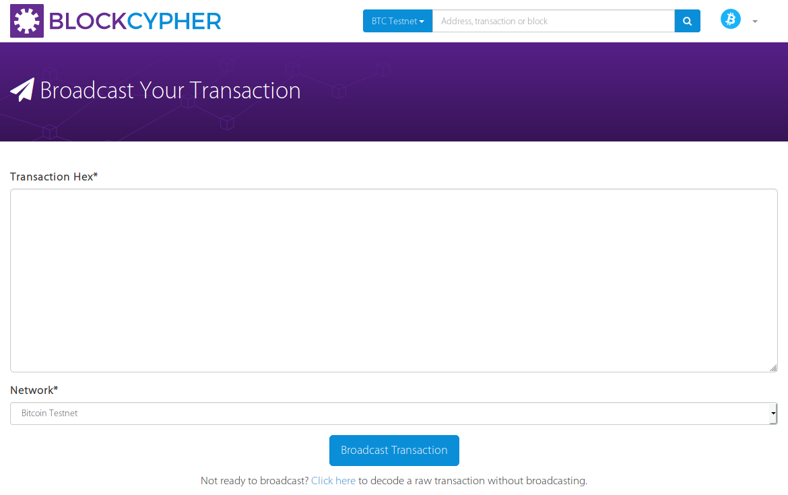

================
Raw Transactions
================

|langname| generates real Bitcoin transactions, both for the mainnet and the testnet.
This page explains how to publish transactions and use real
transactions in |langname|.

---------------------
Publish a transaction
---------------------

|langname| transactions are compiled in a *raw format*,
i.e. transactions are serialized to a string of bytes encoded in hexadecimal format.

You can use the Bitcoin client, or trust online services, to publish
raw transactions.
For example, the explorer BlockCypher allows to publish transaction on the testnet through the page
https://live.blockcypher.com/btc-testnet/pushtx/.
Since private keys are never part of a transaction, it's perfectly fine to
use external services to broadcast a transaction.
At worst, the transaction may be dropped.

--------------------------
Real transactions as Input
--------------------------

|langname| supports real Bitcoin transactions,
expressed in hexadecimal format.
The prefix :balzac:`tx:`, followed by the hexadecimal string of a serialized transaction,
permits to create a constant of type :balzac:`transaction`
that can be used as input.

.. code-block:: balzac

    const Traw = tx:020000000001028a4415d1954ed05164e294...

    transaction T1 {
        input = Traw : sig(k)
        output = ...
    }

|langname| still checks that the witness correctly spends
the input transaction.
However, there is a limitation that depends on Bitcoin output 
scripts format and
the following section explains 
how |langname| compiles the output scripts and how to use
the two kinds of transaction that it may generate.

.. Tip ::
    **How to obtain the hexadecimal payload of a transaction?**

    Using a Bitcoin explorer, for example:

     - https://live.blockcypher.com 
     - https://chain.so/

    In general an explorer provides an API to get transactions information, like the hexadecimal payload.

    For example, supposing you have the transaction id ``c21a1fe9cfa19e046cd8279f899ae1179fa4bd4d9b5c6e2b2ae72c417b21cd34``, you can get the transaction payload with the following command:

    .. code-block:: bash

        curl -s 'https://api.blockcypher.com/v1/btc/test3/txs/c21a1fe9cfa19e046cd8279f899ae1179fa4bd4d9b5c6e2b2ae72c417b21cd34?limit=50&includeHex=true' \
          | jq .hex -r

    The output should be like:

    .. code-block:: none

        010000000001020e5e36d31db07ef92b93d48243c12fef395745cf70490301bfa04d2a1b73968b000000002322002019ecd7474e6443c7a2a2636ff30e15ae8a8ef44b2c026185233485d94cf83ba6ffffffff606b58f4ddafeafeb69aa0124adb31a48c23c460bb242225b7590ba0713f0237000000002322002019ecd7474e6443c7a2a2636ff30e15ae8a8ef44b2c026185233485d94cf83ba6ffffffff0240420f000000000017a914b7845c73bfbeaaedd7b7c3338537f617665ff46487d14413000000000017a9149381e7c97d7af0e89d497b1c26e3af71366e42f3870400473044022010fe9047e11bba44f1e1b4e72cf25eb627311236409d8c991321ee11abeccae7022043df2c0b25c61a157173729e5ec7ce3229435fffc1f88345e1ffc5f2d47408da01473044022005b465788f1e30f04a9aa231da74c3acc0ed786a2ecdb51d38ba476b14e589bb022011e8d7a65f5be382d3efdcfe631557a64582607d0338611e2940aaa2ff7afde301475221032da83b817dee057d797098ee5fe109de33b0c740c00ca503d1a0b458141695f92103b04e3dce7d502b33eac31f52fca7189bdaa0b1ce37698cedad6de28e0ffb3f7a52ae0400473044022001dc8c1a753fc6b235fbe3378548d05fbb5930fa4941d283ec5d7249bf9b2e9d0220467780932cb360762b99dfa98dc6bc9806554408ef64930c25adfeccde93dca501483045022100fd74d6be08eff46fe98110ea75d4c9a25478ba46703ad5e9e14519f6eda703e7022062830697422d242fc48d09c2be0b907063be4bda7357477b5e11c0ccfc31ab4001475221032da83b817dee057d797098ee5fe109de33b0c740c00ca503d1a0b458141695f92103b04e3dce7d502b33eac31f52fca7189bdaa0b1ce37698cedad6de28e0ffb3f7a52ae00000000

---------------------
Output scripts format
---------------------

|langname| provides an high-level language to express output scripts.
Bitcoin supports some types of output scripts format. Some of them are:

- **P2PK** (*Pay to Public Key*), which encode the public key in the output.
  This format is **deprecated** by P2PKH.

- **P2PKH** (*Pay to Public Key Hash*) which encode the hash of the public key in the output,
  and the public key must be provided as input (alongside a signature).

- **P2SH** (*Pay to Script Hash*) which encodes the hash of the script in the output and
  requires the script to be provided as input (alongside its actual parameters).

|langname| adopts P2PKH and P2SH to encode output scripts.

^^^^^
P2PKH
^^^^^

|langname| compiles :balzac:`fun(x) . versig(k;x)` as P2PKH,
i.e. Pay to Public Key Hash.

The public key is hashed and stored in the output script.
Anyone who wants to redeem this output must provide a valid signature
and the public key that corresponds with this hash.

This pattern is so common and widespread that the notion of
*Bitcoin address* arose from it.
In Bitcoin, an address is the **hash** of the public key encoded in
`Base 58 <https://en.wikipedia.org/wiki/Base58>`_ 
(plus other information like the network type and a checksum).
See `Address - Bitcoin Wiki <https://en.bitcoin.it/wiki/Address>`_
for further details.

As an example, consider the transaction ``T`` defined below.

.. code-block:: balzac

    const kpub = pubkey:020ffce813c6e42b76e56aaa794a001f9f27e09d9dbe5a5a83d9712f9ba4fdbe8b

    transaction T {
        input = _
        output = 10 BTC : fun(x) . versig(kpub;x)
    }

The public key ``kpub`` is hashed and stored in the output script of ``T``.
The Bitcoin address associated to ``kpub`` is ``mkYSk8yaNfurMmo5aPsPPDym6hjz6VM2un``
and can be obtained in Balzac typing :balzac:`kpub.toAddress`.

A transaction ``T1`` that spends ``T`` is shown in the following example.

.. code-block:: balzac

    const k = key:cRLAzgrJJQA61pcUkUeasn2FDXLEuWxfXMY4YeGs3cXUCf7vj4bU

    transaction T1 {
        input = T : sig(k)
        output = 10 BTC : fun(x) . ... 
    }

The witness of ``T1`` provides a valid signature for ``kpub``.
However, remember that ``kpub`` is not stored in the output script of ``T``,
but only its hash.
In theory, the public key should be provided alongside with the signature :balzac:`sig(k)`,
so that it can be compared with the hash in the output script before the validation.
In practice, |langname| recognizes P2PKH output scripts and provides
the public key for us.

.. code-block:: balzac
    :emphasize-lines: 4

    const k = key:cRLAzgrJJQA61pcUkUeasn2FDXLEuWxfXMY4YeGs3cXUCf7vj4bU

    transaction T1 {
        input = T : sig(k) kpub     // Error: invalid number of witnesses
        output = 10 BTC : fun(x) . ... 
    }

"""""""""""""""""""""""""""""
Serialized P2PKH transactions
"""""""""""""""""""""""""""""

Transactions that encode P2PKH outputs can be smoothly used in |langname|.

.. code-block:: balzac

    const kpub = pubkey:020ffce813c6e42b76e56aaa794a001f9f27e09d9dbe5a5a83d9712f9ba4fdbe8b

    transaction T {
        input = _
        output = 10 BTC : fun(x) . versig(kpub;x)
    }
    
    const Traw = tx:02000000010000000000000000000000000000000000000000000000000000000000000000ffffffff02012affffffff0100ca9a3b0000000017a91413e090734f942aba5c7cdaf98caaa7ce19cadc368700000000

    eval T == Traw  // true

In this example, the transaction ``Traw`` is obtained by the serialization of ``T``.
As you can notice below, ``T1`` spends ``Traw`` and
there is no difference between redeeming ``T`` or ``Traw``.

.. code-block:: balzac
    :emphasize-lines: 4

    const k = key:cRLAzgrJJQA61pcUkUeasn2FDXLEuWxfXMY4YeGs3cXUCf7vj4bU

    transaction T1 {
        input = Traw : sig(k)
        output = 10 BTC : fun(x) . ... 
    }

^^^^
P2SH
^^^^

|langname| compiles all the output scripts that are different from
:balzac:`fun(x) . versig(k;x)` as P2SH,
i.e. Pay to Script Hash.

The script is serialized, then hashed, and finally stored in the output script.
Anyone who wants to redeem this output must provide
the actual parameters for the script
and the script itself, serialized. If the script hash matches the
hash in the output script and its execution evaluates to true,
the output is redeemed.

Consider the following example.

.. code-block:: balzac

    const kpub = pubkey:020ffce813c6e42b76e56aaa794a001f9f27e09d9dbe5a5a83d9712f9ba4fdbe8b

    transaction T {
        input = _
        output = 10 BTC : fun(x, secret:string) . 
            versig(kpub;x) && sha1(secret) == hash:aaf4c61ddcc5e8a2dabede0f3b482cd9aea9434d
    }

The output script takes two inputs, a signature ``x`` and a string ``secret``,
and evaluates to true if ``x`` is valid signature for ``kpub``
and the :balzac:`sha1` of ``secret`` is equal to the embedded hash.

A transaction ``T1`` that spends ``T`` is shown in the following example

.. code-block:: balzac

    const k = key:cRLAzgrJJQA61pcUkUeasn2FDXLEuWxfXMY4YeGs3cXUCf7vj4bU

    transaction T1 {
        input = T : sig(k) "hello"
        output = 10 BTC : fun(x) . ... 
    }

Remember that the output script of ``T`` is not stored when the transaction
is serialized. So, alongside the actual parameters :balzac:`sig(k) "hello"`,
the transaction ``T1`` should provide the output script.
However, in |langname| this is not required because it is done automatically.

""""""""""""""""""""""""""""
Serialized P2SH transactions
""""""""""""""""""""""""""""

Problems arise when the output script of a *serialized* transaction is a P2SH.
In fact, a serialized P2SH only contains the hash of the script.

Consider the following example.

.. code-block:: balzac

    const kpub = pubkey:020ffce813c6e42b76e56aaa794a001f9f27e09d9dbe5a5a83d9712f9ba4fdbe8b

    transaction T {
        input = _
        output = 10 BTC : fun(x, secret:string) . 
            versig(kpub;x) && sha1(secret) == hash:aaf4c61ddcc5e8a2dabede0f3b482cd9aea9434d
    }

    const Traw = tx:02000000010000000000000000000000000000000000000000000000000000000000000000ffffffff02012affffffff0100ca9a3b0000000017a9149a43eb9f4ae32ff9234dc1ba92ebfeffc83c18e78700000000

    eval T == Traw      // true

In this example, the transaction ``Traw`` is obtained by the serialization of ``T``.
However, the following example will not work.

.. code-block:: balzac
    :emphasize-lines: 4

    const k = key:cRLAzgrJJQA61pcUkUeasn2FDXLEuWxfXMY4YeGs3cXUCf7vj4bU

    transaction T1 {
        input = Traw : sig(k) "hello"   // Error
        output = 10 BTC : fun(x) . ... 
    }

When using a raw transaction as input,
**the output script of the transaction must be provided**
beside the actual parameters. 
There is no chance that |langname| will guess what is the output script
just looking at its hash.

The script, called *redeem script*,
is specified between square brackets
``[]``, after the witnesses.
In the following example, ``T1`` spends ``Traw``
providing the redeem script.

.. code-block:: balzac
    :emphasize-lines: 4

    const k = key:cRLAzgrJJQA61pcUkUeasn2FDXLEuWxfXMY4YeGs3cXUCf7vj4bU

    transaction T1 {
        input = Traw : sig(k) "hello" [fun(x, secret:string) . versig(kpub;x) && sha1(secret) == hash:aaf4c61ddcc5e8a2dabede0f3b482cd9aea9434d]
        output = 10 BTC : fun(x) . ...
    }

If the script is not specified, |langname| complains 
that the redeem script is missing.
Also, a wrong script will result in a wrong evaluation,
and ``T1`` does not redeem ``Traw``.
